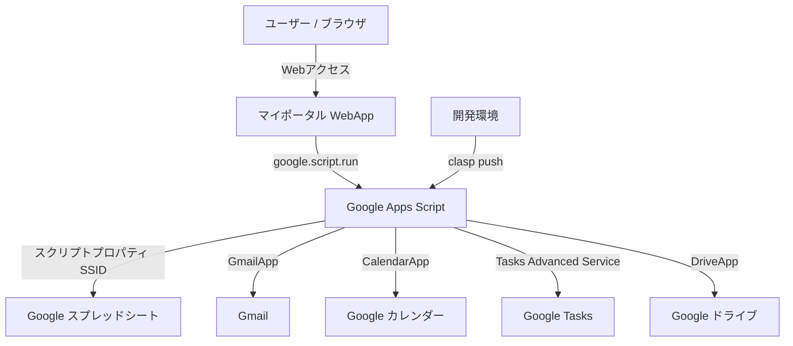

# マイポータル (MyPortal)

- **作成者**: TeKun33
- **バージョン**: 1.1.3
- **デプロイ先**: [Web App URL](https://script.google.com/macros/s/AKfycbw9pZTRX4idXfr5XPbreF1_6PLQnZsuDRsMR6f2jsvWbpO1y79KLCm1SHfUyrMYRMTD/exec)
- **プラットフォーム**: Google Apps Script (GAS)

このWebアプリケーションは、Google Antigravityを用いて作成しました。
Google Apps Script (GAS) 上で動作する、高機能なパーソナルポータル Web アプリケーションです。
Gmail、Google カレンダー、Google Tasks、QRコード生成ツール、およびカテゴリ分類・並び替え対応の個人ブックマークを1画面に統合し、日々の作業効率を最大化します。

Google clasp (Command Line Apps Script Projects) によるローカル管理に対応し、デスクトップからスマートフォンまで快適に動作するレスポンシブ設計を採用しています。

---

## 主な特徴

- **Google サービスをワンストップで統合**: Gmail・カレンダー・タスクを瞬時に確認・操作。外部公式サービスへのリンクボタンも完備。
- **モダンで洗練された UI/UX**: Tailwind CSS v4 & ガラスモーフィズムを取り入れたカードデザイン、滑らかなスライディングインジケーター、スケルトンローディング。
- **高機能なブックマーク管理**:
  - カテゴリタブによる瞬時のフィルタリングと未分類の自動整理。
  - カテゴリタブおよびブックマークカードの**ドラッグ＆ドロップ並び替え**に対応。
  - カテゴリ管理モーダルからカテゴリの追加、並び替え、不要カテゴリの削除が可能。
  - 実務・開発・Webなど多岐にわたる用途を網羅した厳選 140 種以上のアイコンピッカー（検索・カテゴリ対応）。
- **QRコード生成 & クラウド保存**:
  - 任意のURLやテキストからリアルタイムにQRコードをプレビュー生成。
  - サイズ、前景色・背景色、エラー訂正レベルの自由なカスタマイズ。
  - ローカルダウンロード（PNG, JPEG, SVG）に加え、Google ドライブ（「マイポータル - QRコード」フォルダ）への直接保存に対応。
- **完全レスポンシブ対応**: PC・タブレット・スマートフォン（カレンダースクロールスナップ、今日カラム自動フォーカス等）に最適化。
- **豊富なテーマ & ダークモード**: 5色のプリセットテーマ（Ocean, Sunset, Forest, Lavender, Rose）とダークモード切り替えに対応。
- **安心のセキュリティ & 利用規約同意ゲート**:
  - 全画面の利用規約同意オーバーレイ（Terms Gate）とサーバーサイド（`assertTermsAgreed`）での厳格なアクセス制御。
  - Google アカウントに紐付く専用スプレッドシート内で安全にデータを完結。全操作ログを自動記録。

---

## 機能一覧

### 1. ヘッダー・ポータル共通

- **リアルタイム時計 & 日付表示**: 現在時刻と日付・曜日を常時表示（モバイル環境では省スペース表示に自動最適化）。
- **アカウント表示**: ログイン中の Google アカウント（メールアドレス）を表示。
- **テーマカラーピッカー**: 5色（オーシャン、サンセット、フォレスト、ラベンダー、ローズ）から好みのアクセントカラーを選択可能。
- **ダークモード切り替え**: ライト / ダークの表示モードを即座に切り替え。
- **アップデート情報モーダル**: バージョンごとの更新内容や修正履歴をアプリ内から手軽に確認可能。

### 2. ブックマーク機能

- **一覧表示**: 登録したブックマークをグリッドレイアウトで表示（モバイル・PC それぞれに最適なカラム数に可変）。
- **カテゴリタブバー & 絞り込み**:
  - 「すべて」タブおよび登録されたカテゴリ、未分類カテゴリのタブを自動生成。
  - 各タブに登録件数バッジを表示。
  - アクティブなタブに滑らかに追従するスライディングインジケーター。
  - カテゴリタブ自体をドラッグ＆ドロップして並び替え可能（スプレッドシート & LocalStorage に自動保存）。
- **カテゴリ管理モーダル**:
  - 登録済みカテゴリの一覧確認と件数把握。
  - 新規カテゴリの追加。
  - 上下矢印ボタン（↑ / ↓）によるカテゴリの並び替え。
  - 登録件数 0 件の空カテゴリの削除。
- **ブックマークのドラッグ＆ドロップ並び替え**: 直感的なドラッグ操作でカードの表示順を変更可能（スプレッドシートへ自動保存）。
- **厳選アイコンカタログ**: 140 種以上の実用アイコンから選択可能（カテゴリ分類、日本語・英語キーワード検索対応）。
- **追加・編集・削除**: タイトル、URL、カテゴリ（既存選択または直接入力）、アイコンを指定して手軽に追加・編集・削除。

### 3. 統合タブウィジェット

#### Gmail

- 受信トレイの最新メッセージ（最大50件）を取得・表示。
- 未読 / 既読ステータスバッジ。
- 送信者名、件名、本文スニペット、受信日時（相対時間表示）のプレビュー。
- クリックで Gmail 本文へ直接アクセス。
- 更新中のスピナー＆ローディングバッジ表示。

#### Google カレンダー

- **週間ビュー表示**: 7日間の予定をカラム形式で視覚的に表示。
- **モバイル最適化**: スクロールスナップ対応。小画面表示時には「今日」のカラムへ自動スムーズスクロール。
- **ナビゲーション**: 「前週」「今週」「次週」の切り替えに対応。
- **予定の作成・編集・削除**:
  - タイトル、日時（開始 / 終了）、説明の入力
  - 11色のカラーラベル選択
  - 終日イベント & 複数日にまたがる終日イベントに対応
- **優れた操作性**: 予定チップ内の編集・削除ボタンのクリック領域拡大および誤タップ防止（イベント伝播制御）。
- **外部連携**: ヘッダーの「カレンダーを開く」ボタンから Google カレンダー公式 Web を新規タブで開く。

#### Google Tasks (タスク)

- タスクリスト一覧およびタスクの表示。
- タスクの完了 / 未完了切り替え（チェックボックス操作）。
- タスクの追加（タイトル、詳細メモ、期限日時の指定）。
- タスクの編集（タイトル、詳細メモ、期限、所属タスクリストの変更およびリスト間移動）。
- タスクの削除。
- **外部連携**: ヘッダーの「タスクを開く」ボタンから Google Tasks を新規タブで開く。

#### QRコード生成ツール

- **リアルタイム生成**: URLやテキストを入力すると即座にQRコードプレビューを生成。
- **デザインカスタマイズ**:
  - サイズ調整（128px 〜 512px のスライダー操作）
  - 前景色 & 背景色の指定（カラーピッカーおよび HEX 入力に対応）
  - エラー訂正レベルの選択（L: 〜7%, M: 〜15%, Q: 〜25%, H: 〜30%）
- **保存形式の選択**: PNG, JPEG, SVG の各フォーマットに対応。
- **ローカル保存**: ブラウザからワンクリックで画像ファイルをダウンロード。
- **Google ドライブ保存**: GAS サーバー経由で Google ドライブ内に「マイポータル - QRコード」フォルダを自動作成し直接保存（ファイル URL を通知＆監査ログ記録）。
- **外部連携**: ヘッダーの「ドライブを開く」ボタンから Google ドライブを新規タブで開く。

### 4. セキュリティ & 管理機能

- **利用規約同意ゲート (Terms Gate) とアクセス制御**:
  - 初回アクセス時または未同意ユーザーに対して全画面同意オーバーレイを表示し、同意するまで個人データ（Gmail・カレンダー・タスク・ブックマーク）の読み込みを完全停止。
  - 同意チェックボックス必須化、同意拒否時の案内画面および再確認フロー。
  - バックエンド (`Code.js`) に `assertTermsAgreed` ガードを実装し、すべてのデータ操作 API で未同意アクセスをサーバー側で完全遮断。
  - クライアント側（`localStorage`）とスプレッドシート間での同意状態の高速判定＆双方向同期。
- **スプレッドシート連携 & ユーザー個別管理**:
  - スクリプトプロパティ `SSID` で指定されたスプレッドシートに、ユーザーごとの専用シート（メールアドレス名）を自動生成。設定情報、カテゴリ並び順、ブックマーク、利用規約同意状態を個別に永続化。
  - `__TERMS__` シートに全ユーザーの利用規約同意ステータス・同意日時を一覧集約。
  - `__LOG__` シートに日時・操作ユーザー・操作内容・詳細を自動記録。

---

## システム構成 & 使用技術



### 技術スタック

| 分類 | 技術 / ツール |
| :--- | :--- |
| **フロントエンド** | HTML5, Vanilla JavaScript (ES6+), CSS3 (CSS Variables, Backdrop Filter) |
| **CSS フレームワーク** | Tailwind CSS v4 (`@tailwindcss/browser@4`) |
| **外部ライブラリ** | QRCode.js (`qrcode.min.js`) |
| **アイコン & フォント** | Material Symbols Rounded, Google Fonts (Inter, Noto Sans JP) |
| **バックエンド** | Google Apps Script (V8 Runtime) |
| **開発 / デプロイツール** | `@google/clasp` |
| **データベース / ストレージ** | Google Spreadsheet (ユーザー別シート + `__LOG__` + `__TERMS__`), LocalStorage |
| **外部連携** | GmailApp, CalendarApp, Google Tasks API (Advanced Service v1), DriveApp |

---

## プロジェクト構成

```text
マイポータル/
├── .clasp.json        # clasp 設定ファイル (Script ID, ルートディレクトリ等)
├── appsscript.json    # GAS マニフェスト (タイムゾーン, Tasks API, WebApp設定)
├── Code.js            # サーバーサイド処理 (GAS API, スプレッドシート読み書き, ログ, Drive保存)
├── index.html         # クライアントサイド UI/UX (HTML / CSS / JavaScript)
├── README.md          # プロジェクト説明書 (本ファイル)
└── LICENSE            # MIT ライセンス
```

---

## セットアップ & デプロイ手順

### ステップ 1: スプレッドシートの準備

1. [Google スプレッドシート](https://sheets.google.com/) を新規作成します。
2. 作成したスプレッドシートの **スプレッドシートID** をメモしておきます。
   - スプレッドシート URL の `https://docs.google.com/spreadsheets/d/{スプレッドシートID}/edit` の部分です。

### ステップ 2: スクリプトプロパティ (`SSID`) の設定

本アプリはスプレッドシート ID をスクリプトプロパティから取得します。

1. Apps Script エディタ（[script.google.com](https://script.google.com/)）を開きます。
2. 左メニューの **「プロジェクトの設定」 (⚙️ アイコン)** をクリックします。
3. **「スクリプト プロパティ」** セクションで **「スクリプト プロパティを追加」** をクリックします。
   - **プロパティ**: `SSID`
   - **値**: ステップ1でメモしたスプレッドシートID
4. **「スクリプト プロパティを保存」** をクリックします。

### ステップ 3: ソースコードの配置 & Google Tasks API の有効化

1. **コードの配置**:
   - エディタ左側のファイル一覧から `Code.gs` を開き、本リポジトリの `Code.js` の内容を貼り付けて保存します。
   - ファイル一覧上部の **「+」**（ファイルを追加）> **「HTML」** をクリックし、ファイル名に `index` と入力して作成します（`index.html` が作成されます）。
   - 本リポジトリの `index.html` の内容を貼り付けて保存します。
2. **Google Tasks API（拡張サービス）の有効化**:
   - エディタ左サイドバーの **「サービス」(+)** をクリックします。
   - 一覧から **「Google Tasks API」** を選択します。
   - バージョンを `v1`、識別子を `Tasks` のまま **「追加」** をクリックします。

### ステップ 4: ウェブアプリとしてデプロイ

1. Apps Script エディタの画面右上にある **「デプロイ」** > **「新しいデプロイ」** をクリックします。
2. 種類の選択で **「ウェブアプリ」** を選択します。
3. 設定項目を確認・設定します：
   - **次のユーザーとして実行**: `アクセスしているユーザー` (USER_ACCESSING)
   - **アクセスできるユーザー**: `全員` (ANYONE) または `自分のみ` (※用途に応じて設定)
4. **「デプロイ」** をクリックし、初回アクセス権限の承認（OAuth 認証）を完了します。
5. 発行された **ウェブアプリの URL** にアクセスするとマイポータルが利用可能になります。

---

## スプレッドシートのデータ構造

### 1. ユーザー別シート

ログインユーザーのメールアドレス名で自動作成されます。

- **1行目 (設定)**:  
  `__SETTINGS__` | `theme` | `{ocean|sunset|forest|lavender|rose}` | `darkMode` | `{true|false}` | `termsAgreed` | `{true|false}` | `termsAgreedAt` | `{同意日時}` | `categoryOrder` | `{カテゴリ並び順JSON配列}`
- **2行目 (ヘッダー)**:  
  `__BOOKMARKS__` | `タイトル` | `URL` | `カテゴリ` | `アイコン` | `追加日時`
- **3行目以降 (ブックマーク一覧)**:  
  各ブックマークのレコード（行順がそのままフロントエンドの並び順に反映されます）。

### 2. 利用規約同意管理シート (`__TERMS__`)

全ユーザーの利用規約同意状況が集約・管理されます。

| カラム | 内容 | 例 |
| :--- | :--- | :--- |
| **ユーザー** | 対象者のメールアドレス | `user@example.com` |
| **同意ステータス** | 同意状態 | `同意済み` / `未同意` |
| **同意日時** | 初回同意日時（`yyyy/MM/dd HH:mm:ss`） | `2026/09/04 20:50:00` |
| **最終更新日時** | 状態の最終更新日時 | `2026/09/04 20:50:00` |

### 3. ログシート (`__LOG__`)

システム全体の全操作が追記されます。

| カラム | 内容 | 例 |
| :--- | :--- | :--- |
| **日時** | 操作実行日時（`yyyy/MM/dd HH:mm:ss`） | `2026/09/03 18:05:00` |
| **ユーザー** | 操作者のメールアドレス | `user@example.com` |
| **操作** | 操作カテゴリ | `ブックマーク`, `カレンダー`, `タスク`, `設定`, `QRコード` |
| **詳細** | 操作内容の詳細 | `新しいブックマークを追加しました`, `カレンダー予定を更新しました`, `QRコードをGoogle Driveに保存しました` |

---

## 更新履歴

- **v1.1.3 (2026/09/18)**:
  - **ブックマークのカテゴリ機能 & 並び替え機能の追加**:
    - カテゴリタブバーによるカテゴリ別のブックマーク絞り込み・一覧表示（各カテゴリ件数バッジ付き）
    - アクティブカテゴリに滑らかに追従するスライディングインジケーター
    - カテゴリタブ自体のドラッグ＆ドロップによる直感的な並び替え（ローカルストレージおよびスプレッドシート設定行 `categoryOrder` への双方向永続化）
    - カテゴリ管理モーダル（新規カテゴリの自由追加、↑↓矢印ボタンでの並び替え、ブックマーク登録数0件の空カテゴリ削除）
    - ブックマーク追加・編集モーダルでのカテゴリ選択（既存リストからのプルダウン選択または新規カテゴリ直接入力）
    - アイコンとカテゴリの独立管理（URL・タイトル・カテゴリ・アイコンの完全分離）
  - **QRコード生成機能 & Google ドライブ連携の追加**:
    - 任意のURLやテキストを入力してリアルタイムにQRコードを生成・プレビュー
    - サイズ（128px〜512px）、前景色・背景色（カラーピッカー＆HEX入力連動）、エラー訂正レベル（L/M/Q/H：最大30%復元）の自由なカスタマイズ
    - 画像形式（PNG, JPEG, SVG）を選択してローカルダウンロード
    - Google Apps Script の `DriveApp` を活用し、Google ドライブ上に「マイポータル - QRコード」フォルダを自動作成して直接保存（生成画像の URL をトースト通知）
    - QRコードヘッダーに Google ドライブへの外部リンクボタン「ドライブを開く」を追加
  - **カレンダー & タスクの操作性改善**:
    - カレンダー予定チップ内の編集・削除ボタンのクリック領域拡大（`min-width: 24px`）とイベント伝播制御（`stopPropagation`）により、誤タップを防止し直感的な操作を実現
    - Google Tasks 各行の編集ボタン（鉛筆アイコン）およびタスク行クリックからの編集モーダル展開、所属タスクリスト間移動（insert & remove）対応
  - **Google サービスとの外部連携強化**:
    - 各ウィジェットヘッダーに公式サービスへの外部リンクボタンを追加（Google カレンダー、Google Tasks、Google ドライブ）
  - **利用規約同意ゲートとセキュリティ・アクセス制御の強化**:
    - 初回訪問時または利用規約未同意のユーザーに対し、全画面の利用規約同意オーバーレイを表示し規約への同意を必須化
    - 同意チェックボックスをオンにするまで同意ボタンが無効化される安全設計と、「同意しない」選択時の案内ビュー（拒否画面）・再確認フローを実装
    - 利用規約に同意するまで、Gmail・カレンダー・タスク・ブックマークなどのアプリデータの読み込みを完全に停止
    - バックエンド (`Code.js`) に `assertTermsAgreed` を実装し、すべてのデータ取得・操作 API（ブックマーク・カレンダー・Gmail・タスク・QRコード）においてサーバーサイドで未同意アクセスを完全遮断
    - クライアント側（`localStorage`）とスプレッドシート（個別設定行および `__TERMS__` 集約シート）間での同意状態の高速判定＆双方向同期
  - **ブックマーク用アイコンカタログの拡充 & 操作性改善**:
    - 実務・開発・学習・生活・Web・メディアなど多岐にわたる用途を網羅する 140 種以上の実用アイコンを厳選・拡充（複数カテゴリ所属に対応）
    - アイコン選択ピッカーのテキスト選択防止 (`user-select: none`)、スクロールバーの安定化、フォーカス・アクティブ状態の視認性向上
    - 検索キーワードの拡充により、目的のアイコンを日本語・英語の多様な語句で素早く検索可能に
  - **UI/UX の視認性・操作性の統一と洗練**:
    - ブックマークカードおよびカレンダー予定の削除ボタンアイコンを `close` (×) から `delete` (ゴミ箱アイコン) に統一し、削除操作の認知性を向上
    - カレンダー日付セルの「予定を追加」ボタンアイコンを `calendar_add_on` に変更し、直感的な操作感を向上
- **v1.1.0 (2026/09/05)**:
  - **ブックマーク機能の全面刷新**:
    - 外部ファビコン自動取得（Google S2 Favicon API）を完全に廃止し、統一感とプライバシーに優れた「アイコン選択方式」へと移行
    - ブックマークに最適な実用アイコンを厳選した（140種・複数カテゴリ所属対応）アイコンピッカー（複数カテゴリ所属、日本語キーワード検索、件数表示対応）を搭載
    - ブックマークの編集機能（タイトル・URL・アイコンの変更）を追加
    - アイコンホバー時のマイクロアニメーションとテーマカラー連動の強化
  - **カレンダー & タスクの操作性改善**:
    - カレンダー各日付ヘッダーの「＋」ボタンや空き枠から直接予定を作成可能に
    - 終日予定と時間指定の動的入力切り替え（終日選択時は時刻欄を自動非表示）
    - カレンダー予定詳細メモおよびタスクメモ枠を複数行入力（textarea）に対応
  - **フォーム入力補助 & UI/UX の視認性強化**:
    - モーダルフォーム内の必須入力項目に「必須」バッジを明示
    - 未入力送信時のインラインエラー通知および自動フォーカス、入力開始時の自動エラー解除
    - Gmail のメール取得・更新中の視覚的ローディングインジケータ（スピナー＆バッジ）を追加
  - **セキュリティ & データ管理の強化**:
    - ユーザー専用シートによる個別データ永続化（設定・ブックマーク・同意状態）
    - 初回利用規約・プライバシー方針の同意フローおよび集約管理用シート（`__TERMS__`）への自動永続化
- **v1.0.1 (2026/09/03)**:
  - スクリプトプロパティ `SSID` によるスプレッドシート分離・連携に対応
  - `clasp` 環境の整備 (`.clasp.json`, `appsscript.json`)
  - Tailwind CSS v4 への移行およびスマートフォン・タブレット向け UI/UX の大幅改善（レスポンシブ表示、カレンダースクロールスナップ、今日カラム自動スクロールなど）
  - 操作ログ（`__LOG__`）の記録形式を簡潔・統一された形式に最適化
- **v1.0.0 (2026/09/02)**:
  - 初回リリース版

---

## ライセンス

本プロジェクトは「MIT License」のもとで公開されています。
