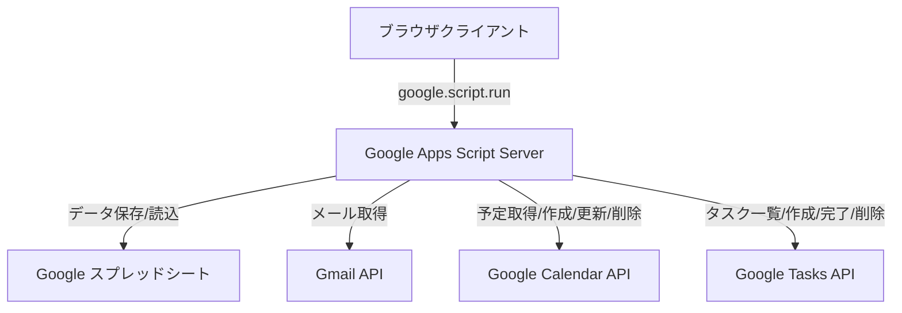

# マイポータル (MyPortal)

作成者: TeKun33  
バージョン: 1.0.0  
デプロイ先: [URL](https://script.google.com/macros/s/AKfycbwF28_zQHC4lnTpBe2gR3s4QaS7O_7G9t8uuM3Z92nhkQyskXgzMhh1Hni1-onP43gW/exec)  
プラットフォーム: Google Apps Script (GAS)

Google Apps Script (GAS)上で動作する高機能なパーソナルポータルWebアプリケーションです。
Gmail、Googleカレンダー、Google Tasks、および個人ブックマークを1画面に統合し、日々の作業効率を最大化します。

---

## 主な特徴

- **Googleサービスをワンストップで統合**: Gmail・カレンダー・タスクを瞬時に確認・操作。
- **モダンで洗練されたUI**: ガラスモーフィズムを取り入れたカードデザイン、滑らかなアニメーション、スケルトンローディング。
- **豊富なテーマ&ダークモード**: 5色のプリセットテーマ（Ocean, Sunset, Forest, Lavender, Rose）とダークモード切り替え。
- **直感的なブックマーク管理**: ファビコン自動取得、ドラッグ&ドロップによる並び替え。
- **安心のセキュリティ&ログ管理**: Googleアカウントおよび紐付くスプレッドシート内のみで安全にデータを完結。全操作ログを自動記録。

---

## 機能一覧

### 1. ダッシュボード & ヘッダー

- **リアルタイム時計 & 日付表示**: 現在時刻と日付・曜日を常時表示。
- **アカウント表示**: ログイン中の Google アカウント（メールアドレス）を表示。
- **テーマカラーピッカー**: 5色（オーシャン、サンセット、フォレスト、ラベンダー、ローズ）から好みのアクセントカラーを選択可能。
- **ダークモード切り替え**: ライト / ダークの表示モードを即座に切り替え。

### 2. ブックマーク機能

- **一覧表示**: 登録したブックマークをグリッドレイアウトで表示。
- **ファビコン自動取得**: URLからドメインを解析し、Google S2 Favicon APIを利用してアイコンを自動表示。
- **ドラッグ&ドロップ並び替え**: 直感的なドラッグ操作で表示順を変更可能（スプレッドシートへ自動保存）。
- **追加・削除**: タイトル、URL、カテゴリを指定して手軽に追加・削除。

### 3. 統合タブウィジェット

#### Gmail

- 受信トレイの最新メッセージ（最大50件）を取得・表示。
- 未読 / 既読ステータスバッジ。
- 送信者名、件名、本文スニペット、受信日時（相対時間表示）のプレビュー。
- クリックで Gmail 本文へ直接アクセス。

#### Google カレンダー

- **週間ビュー表示**: 7日間の予定をカラム形式で視覚的に表示。
- **ナビゲーション**: 「前週」「今週」「次週」の切り替えに対応。
- **予定の作成・編集・削除**:
  - タイトル、日時（開始 / 終了）、説明の入力
  - 11色のカラーラベル選択
  - 終日イベント & 複数日にまたがる終日イベントに対応

#### Google Tasks (タスク)

- タスクリストごとのグループ表示。
- タスクの完了 / 未完了切り替え（チェックボックス操作）。
- タスクの追加（タイトル、詳細メモ、期限日時の指定）。
- タスクの削除。

### 4. セキュリティ & 管理機能

- **スプレッドシート連携**:
  - ユーザーごとの専用シート（メールアドレス名）を自動生成し、設定やブックマークを個別に永続化。
  - `__LOG__` シートに日時・操作ユーザー・操作内容・詳細パラメータを完全記録。
- **初回利用規約同意フロー**: 初回アクセス時に利用規約・プライバシー方針の確認モーダルを表示。
- **更新履歴モーダル**: バージョン情報や更新内容の確認が可能。

---

## システム構成 & 使用技術

### 技術スタック

| 分類 | 技術 / ライブラリ |
| :--- | :--- |
| **フロントエンド** | HTML5, Vanilla JavaScript(ES6+), CSS3(CSS Variables) |
| **UIフレームワーク/スタイリング** | Tailwind CSS(CDN), Custom CSS(Glassmorphism, Animations) |
| **アイコン/フォント** | Material Symbols Rounded, Google Fonts(Inter, Noto Sans JP) |
| **バックエンド** | Google Apps Script(GAS) |
| **データベース/ストレージ** | Google Spreadsheet, Browser LocalStorage(テーマ高速初期化用) |
| **外部連携** | Google Workspace APIs(GmailApp, CalendarApp, Tasks Advanced Service) |

---

## セットアップ&デプロイ手順

### ステップ1: スプレッドシートの準備

1. [Google スプレッドシート](https://sheets.google.com/)を新規作成します。
2. スプレッドシートのタイトルを任意（例:`マイポータル_DB`）に変更します。

### ステップ2: Apps Script プロジェクトの作成

1. スプレッドシート上部メニューの **「拡張機能」** > **「Apps Script」** をクリックします。
2. プロジェクト名を「マイポータル」等に変更します。

### ステップ3: ソースコードの配置

1. **`Code.gs`** を作成し、本リポジトリの `Code.gs` の内容を貼り付けます。
2. **`index.html`** を追加（「+」ボタン > 「HTML」）し、本リポジトリの `index.html` の内容を貼り付けます。

### ステップ 4: Google Tasks API（拡張サービス）の有効化

Google Tasks を利用するために、GASの拡張サービスを有効化します。

1. Apps Script エディタの左サイドバーにある **「サービス」(+)** をクリックします。
2. 一覧から **「Tasks API」** を選択します。
3. バージョンは `v1` を選択し、**「追加」** をクリックします。

### ステップ5: ウェブアプリとしてデプロイ

1. 画面右上の **「デプロイ」** > **「新しいデプロイ」** をクリックします。
2. 種類の選択で **「ウェブアプリ」** を選択します。
3. 以下の設定を行います：
   - **次のユーザーとして実行**: `アクセスしているユーザー` または `自分`
   - **アクセスできるユーザー**: `自分のみ`（または組織内のユーザー）
4. **「デプロイ」** をクリックし、初回アクセス権限の承認（OAuth 認証）を完了します。
5. 発行された **ウェブアプリの URL** にアクセスするとマイポータルが利用可能になります。

---

## スプレッドシートのデータ構造

### 1. ユーザー別シート(`<user_email>`)

ログインユーザーごとに自動生成されます。

- **1行目 (設定)**:
  `__SETTINGS__` | `theme` | `{ocean|sunset|forest|lavender|rose}` | `darkMode` | `{true|false}`
- **2行目 (ヘッダー)**:
  `__BOOKMARKS__` | `タイトル` | `URL` | `カテゴリ` | `アイコン` | `追加日時`
- **3行目以降 (ブックマーク一覧)**:
  各ブックマークのレコード（行順がそのまま表示順序に反映されます）。

### 2. ログシート (`__LOG__`)

システム全体の全操作が追記されます。

| カラム | 内容 |
| :--- | :--- |
| **日時** | 操作実行日時（`yyyy/MM/dd HH:mm:ss`） |
| **ユーザー** | 操作者のメールアドレス |
| **操作** | 操作種別（設定変更、ブックマーク追加、カレンダー予定追加、タスク完了など） |
| **詳細** | 操作の詳細パラメータや対象ID |

---

## 📄 ライセンス

本プロジェクトは「MIT License」の下で公開されています。
