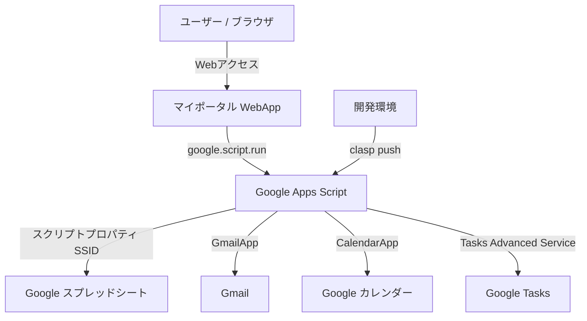

# マイポータル (MyPortal)

- **作成者**: TeKun33
- **バージョン**: 1.1.3_beta
- **デプロイ先**: [Web App URL](https://script.google.com/macros/s/AKfycbw9pZTRX4idXfr5XPbreF1_6PLQnZsuDRsMR6f2jsvWbpO1y79KLCm1SHfUyrMYRMTD/exec)
- **プラットフォーム**: Google Apps Script (GAS)

Google Apps Script (GAS) 上で動作する、高機能なパーソナルポータル Web アプリケーションです。
Gmail、Google カレンダー、Google Tasks、および個人ブックマークを1画面に統合し、日々の作業効率を最大化します。

Google clasp (Command Line Apps Script Projects) によるローカル管理に対応し、デスクトップからスマートフォンまで快適に動作するレスポンシブ設計を採用しています。

---

## 主な特徴

- **Google サービスをワンストップで統合**: Gmail・カレンダー・タスクを瞬時に確認・操作。
- **モダンで洗練された UI/UX**: Tailwind CSS v4 & ガラスモーフィズムを取り入れたカードデザイン、滑らかなアニメーション、スケルトンローディング。
- **直感的なブックマーク管理**: ブックマークに最適な実用アイコンを厳選した（140種・複数カテゴリ所属対応）アイコン選択（複数カテゴリ所属・検索対応）、登録後の編集、ドラッグ＆ドロップによる並び替えに対応。
- **完全レスポンシブ対応**: PC・タブレット・スマートフォン（カレンダースクロールスナップ、今日カラム自動フォーカス等）に最適化。
- **豊富なテーマ & ダークモード**: 5色のプリセットテーマ（Ocean, Sunset, Forest, Lavender, Rose）とダークモード切り替えに対応。
- **安心のセキュリティ & ログ管理**: Google アカウントおよび紐付くスプレッドシート内のみで安全にデータを完結。操作ログを自動記録。

---

## 機能一覧

### 1. ヘッダー・ポータル共通

- **リアルタイム時計 & 日付表示**: 現在時刻と日付・曜日を常時表示（モバイル環境では省スペース表示に自動最適化）。
- **アカウント表示**: ログイン中の Google アカウント（メールアドレス）を表示。
- **テーマカラーピッカー**: 5色（オーシャン、サンセット、フォレスト、ラベンダー、ローズ）から好みのアクセントカラーを選択可能。
- **ダークモード切り替え**: ライト / ダークの表示モードを即座に切り替え。

### 2. ブックマーク機能

- **一覧表示**: 登録したブックマークをグリッドレイアウトで表示（モバイル・PC それぞれに最適なカラム数に可変）。
- **豊富なアイコン選択**: ブックマークに最適な実用アイコンを厳選した（140種・複数カテゴリ所属対応）アイコンを指定。
- **ドラッグ＆ドロップ並び替え**: 直感的なドラッグ操作で表示順を変更可能（スプレッドシートへ自動保存）。
- **追加・編集・削除**: タイトル、URL、お好みのアイコンを指定して手軽に追加・編集・削除。

### 3. 統合タブウィジェット

#### Gmail

- 受信トレイの最新メッセージ（最大50件）を取得・表示。
- 未読 / 既読ステータスバッジ。
- 送信者名、件名、本文スニペット、受信日時（相対時間表示）のプレビュー。
- クリックで Gmail 本文へ直接アクセス。

#### Google カレンダー

- **週間ビュー表示**: 7日間の予定をカラム形式で視覚的に表示。
- **モバイル最適化**: スクロールスナップ対応。小画面表示時には「今日」のカラムへ自動スムーズスクロール。
- **ナビゲーション**: 「前週」「今週」「次週」の切り替えに対応。
- **予定の作成・編集・削除**:
  - タイトル、日時（開始 / 終了）、説明の入力
  - 11色のカラーラベル選択
  - 終日イベント & 複数日にまたがる終日イベントに対応

#### Google Tasks (タスク)

- タスクリスト一覧およびタスクの表示。
- タスクの完了 / 未完了切り替え（チェックボックス操作）。
- タスクの追加（タイトル、詳細メモ、期限日時の指定）。
- タスクの編集（タイトル、詳細メモ、期限、所属タスクリストの変更）。
- タスクの削除。

#### QRコード

- URLやテキストを入力するとQRコードを生成できる（プレビュー表示）。
- 生成したQRコードをローカル保存できる（png形式, jpg形式, svg形式）。
- 生成したQRコードをGoogle Driveに保存できる（png形式, jpg形式, svg形式）。

### 4. セキュリティ & 管理機能

- **スプレッドシート連携**:
  - スクリプトプロパティで指定されたスプレッドシートに、ユーザーごとの専用シート（メールアドレス名）を自動生成。設定やブックマーク、利用規約同意状態を個別に永続化。
  - `__TERMS__` シートに全ユーザーの利用規約同意ステータス・同意日時を一覧集約。
  - `__LOG__` シートに日時・操作ユーザー・操作内容・詳細を自動記録。
- **利用規約同意ゲート（Terms Gate）とアクセス制御**: 初回アクセス時または未同意ユーザーに対して全画面同意オーバーレイを表示し、同意するまでアプリデータの読み込みを完全停止。サーバー側（`Code.gs`）でも未同意ユーザーの API 実行をブロックし、同意ステータスおよび日時をスプレッドシートに永続化。
- **更新履歴モーダル**: バージョンごとの更新内容や修正履歴を確認可能。

---

## システム構成 & 使用技術



### 技術スタック

| 分類 | 技術 / ツール |
| :--- | :--- |
| **フロントエンド** | HTML5, Vanilla JavaScript (ES6+), CSS3 (CSS Variables) |
| **CSS フレームワーク** | Tailwind CSS v4 (`@tailwindcss/browser@4`) |
| **アイコン & フォント** | Material Symbols Rounded, Google Fonts (Inter, Noto Sans JP) |
| **バックエンド** | Google Apps Script (V8 Runtime) |
| **開発 / デプロイツール** | `@google/clasp` |
| **データベース / ストレージ** | Google Spreadsheet (ユーザー別シート + `__LOG__` + `__TERMS__`), LocalStorage |
| **外部連携** | GmailApp, CalendarApp, Google Tasks API (Advanced Service v1) |

---

## プロジェクト構成

```text
マイポータル/
├── .clasp.json        # clasp 設定ファイル (Script ID, ルートディレクトリ等)
├── appsscript.json    # GAS マニフェスト (タイムゾーン, Tasks API, WebApp設定)
├── Code.js            # サーバーサイド処理 (GAS API, スプレッドシート読み書き, ログ)
├── index.html         # クライアントサイド UI/UX (HTML / CSS / JavaScript)
├── README.md          # プロジェクト説明書 (本ファイル)
└── LICENSE            # MIT ライセンス
```

---

## セットアップ & デプロイ手順

### ステップ 1: スプレッドシートの準備

1. [Google スプレッドシート](https://sheets.google.com/) を新規作成します。
2. 作成したスプレッドシートの **スプレッドシートID** をメモしておきます。
   - スプレッドシート URL の `https://docs.google.com/spreadsheets/d/{スプレッドシートID}/edit` の部分です。

### ステップ 2: スクリプトプロパティ (`SSID`) の設定

本アプリはスプレッドシート ID をスクリプトプロパティから取得します。

1. Apps Script エディタ（[script.google.com](https://script.google.com/)）を開きます。
2. 左メニューの **「プロジェクトの設定」 (⚙️ アイコン)** をクリックします。
3. **「スクリプト プロパティ」** セクションで **「スクリプト プロパティを追加」** をクリックします。
   - **プロパティ**: `SSID`
   - **値**: ステップ1でメモしたスプレッドシートID
4. **「スクリプト プロパティを保存」** をクリックします。

### ステップ 3: ソースコードの配置 & Google Tasks API の有効化

1. **コードの配置**:
   - エディタ左側のファイル一覧から `Code.gs` を開き、本リポジトリの `Code.js` の内容を貼り付けて保存します。
   - ファイル一覧上部の **「+」**（ファイルを追加）> **「HTML」** をクリックし、ファイル名に `index` と入力して作成します（`index.html` が作成されます）。
   - 本リポジトリの `index.html` の内容を貼り付けて保存します。
2. **Google Tasks API（拡張サービス）の有効化**:
   - エディタ左サイドバーの **「サービス」(+)** をクリックします。
   - 一覧から **「Google Tasks API」** を選択します。
   - バージョンを `v1`、識別子を `Tasks` のまま **「追加」** をクリックします。

### ステップ 4: ウェブアプリとしてデプロイ

1. Apps Script エディタの画面右上にある **「デプロイ」** > **「新しいデプロイ」** をクリックします。
2. 種類の選択で **「ウェブアプリ」** を選択します。
3. 設定項目を確認・設定します：
   - **次のユーザーとして実行**: `アクセスしているユーザー` (USER_ACCESSING)
   - **アクセスできるユーザー**: `全員` (ANYONE) または `自分のみ` (※用途に応じて設定)
4. **「デプロイ」** をクリックし、初回アクセス権限の承認（OAuth 認証）を完了します。
5. 発行された **ウェブアプリの URL** にアクセスするとマイポータルが利用可能になります。

---

## スプレッドシートのデータ構造

### 1. ユーザー別シート

ログインユーザーのメールアドレス名で自動作成されます。

- **1行目 (設定)**:
  `__SETTINGS__` | `theme` | `{ocean|sunset|forest|lavender|rose}` | `darkMode` | `{true|false}` | `termsAgreed` | `{true|false}` | `termsAgreedAt` | `{同意日時}`
- **2行目 (ヘッダー)**:
  `__BOOKMARKS__` | `タイトル` | `URL` | `カテゴリ` | `アイコン` | `追加日時`
- **3行目以降 (ブックマーク一覧)**:
  各ブックマークのレコード（行順がそのままフロントエンドの並び順に反映されます）。

### 2. 利用規約同意管理シート (`__TERMS__`)

全ユーザーの利用規約同意状況が集約・管理されます。

| カラム | 内容 | 例 |
| :--- | :--- | :--- |
| **ユーザー** | 対象者のメールアドレス | `user@example.com` |
| **同意ステータス** | 同意状態 | `同意済み` / `未同意` |
| **同意日時** | 初回同意日時（`yyyy/MM/dd HH:mm:ss`） | `2026/09/04 20:50:00` |
| **最終更新日時** | 状態の最終更新日時 | `2026/09/04 20:50:00` |

### 3. ログシート (`__LOG__`)

システム全体の全操作が追記されます。

| カラム | 内容 | 例 |
| :--- | :--- | :--- |
| **日時** | 操作実行日時（`yyyy/MM/dd HH:mm:ss`） | `2026/09/03 18:05:00` |
| **ユーザー** | 操作者のメールアドレス | `user@example.com` |
| **操作** | 操作カテゴリ | `ブックマーク`, `カレンダー`, `タスク`, `設定` |
| **詳細** | 操作内容の詳細 | `新しいブックマークを追加しました`, `カレンダー予定を更新しました` |

---

## 更新履歴

- **v1.1.3 (2026/09/14)**:
  - **利用規約同意ゲートとセキュリティ・アクセス制御の強化**:
    - 初回訪問時または利用規約未同意のユーザーに対し、全画面の利用規約同意オーバーレイを表示し規約への同意を必須化
    - 同意チェックボックスをオンにするまで同意ボタンが無効化される安全設計と、「同意しない」選択時の案内ビュー（拒否画面）・再確認フローを実装
    - 利用規約に同意するまで、Gmail・カレンダー・タスク・ブックマークなどのアプリデータの読み込みを完全に停止
    - バックエンド (`Code.js`) に `assertTermsAgreed` を実装し、すべてのデータ取得・操作 API（ブックマーク・カレンダー・Gmail・タスク）においてサーバーサイドで未同意アクセスを完全遮断
    - クライアント側（`localStorage`）とスプレッドシート（個別設定行および `__TERMS__` 集約シート）間での同意状態の高速判定＆双方向同期
  - **QRコード生成機能追加**:
    - URLやテキストを入力するとQRコードを生成できる
    - 生成したQRコードをローカル保存できる（png形式, jpg形式, svg形式）
    - 生成したQRコードをGoogle Driveに保存できる（png形式, jpg形式, svg形式）
  - **Google Tasks (タスク) の編集機能追加**:
    - タスク各行に編集ボタン（鉛筆アイコン）を追加し、タスク内容のクリックでも編集モーダルを開けるよう改善
    - 編集モーダルからタイトル、詳細メモ、期限、所属タスクリストの変更に対応
    - バックエンド (`Code.js`) に `updateTask` を追加し、同一リスト更新（patch）およびリスト間移動（insert & remove）に対応
    - 開発・プレビュー環境のモックデータでもタスクの追加・編集・削除・完了トグルに対応
  - **Google サービスとの外部連携ボタン追加**:
    - カレンダーヘッダーに「カレンダーを開く（Google カレンダーへの外部リンク）」ボタンを追加
    - タスクヘッダーに「タスクを開く（Google Tasks への外部リンク）」ボタンを追加
    - QRコードヘッダーに「ドライブを開く（Google ドライブへの外部リンク）」ボタンを追加
  - **ブックマーク用アイコンカタログの拡充 & 操作性改善**:
    - 実務・開発・学習・生活・Web・メディアなど多岐にわたる用途を網羅する 140 種以上の実用アイコンを厳選・拡充（複数カテゴリ所属に対応）
    - アイコン選択ピッカーのテキスト選択防止 (`user-select: none`)、スクロールバーの安定化、フォーカス・アクティブ状態の視認性向上
    - 検索キーワードの拡充により、目的のアイコンを日本語・英語の多様な語句で素早く検索可能に
  - **UI/UX の視認性・操作性の統一と洗練**:
    - ブックマークカードおよびカレンダー予定の削除ボタンアイコンを `close` (×) から `delete` (ゴミ箱アイコン) に統一し、削除操作の認知性を向上
    - カレンダー日付セルの「予定を追加」ボタンアイコンを `calendar_add_on` に変更し、直感的な操作感を向上
- **v1.1.0 (2026/09/05)**:
  - **ブックマーク機能の全面刷新**:
    - 外部ファビコン自動取得（Google S2 Favicon API）を完全に廃止し、統一感とプライバシーに優れた「アイコン選択方式」へと移行
    - ブックマークに最適な実用アイコンを厳選した（140種・複数カテゴリ所属対応）アイコンピッカー（複数カテゴリ所属、日本語キーワード検索、件数表示対応）を搭載
    - ブックマークの編集機能（タイトル・URL・アイコンの変更）を追加
    - アイコンホバー時のマイクロアニメーションとテーマカラー連動の強化
  - **カレンダー & タスクの操作性改善**:
    - カレンダー各日付ヘッダーの「＋」ボタンや空き枠から直接予定を作成可能に
    - 終日予定と時間指定の動的入力切り替え（終日選択時は時刻欄を自動非表示）
    - カレンダー予定詳細メモおよびタスクメモ枠を複数行入力（textarea）に対応
  - **フォーム入力補助 & UI/UX の視認性強化**:
    - モーダルフォーム内の必須入力項目に「必須」バッジを明示
    - 未入力送信時のインラインエラー通知および自動フォーカス、入力開始時の自動エラー解除
    - Gmail のメール取得・更新中の視覚的ローディングインジケータ（スピナー＆バッジ）を追加
  - **セキュリティ & データ管理の強化**:
    - ユーザー専用シートによる個別データ永続化（設定・ブックマーク・同意状態）
    - 初回利用規約・プライバシー方針の同意フローおよび集約管理用シート（`__TERMS__`）への自動永続化
- **v1.0.1 (2026/09/03)**:
  - スクリプトプロパティ `SSID` によるスプレッドシート分離・連携に対応
  - `clasp` 環境の整備 (`.clasp.json`, `appsscript.json`)
  - Tailwind CSS v4 への移行およびスマートフォン・タブレット向け UI/UX の大幅改善（レスポンシブ表示、カレンダースクロールスナップ、今日カラム自動スクロールなど）
  - 操作ログ（`__LOG__`）の記録形式を簡潔・統一された形式に最適化
- **v1.0.0 (2026/09/02)**:
  - 初回リリース版

---

## ライセンス

本プロジェクトは「MIT License」のもとで公開されています。
